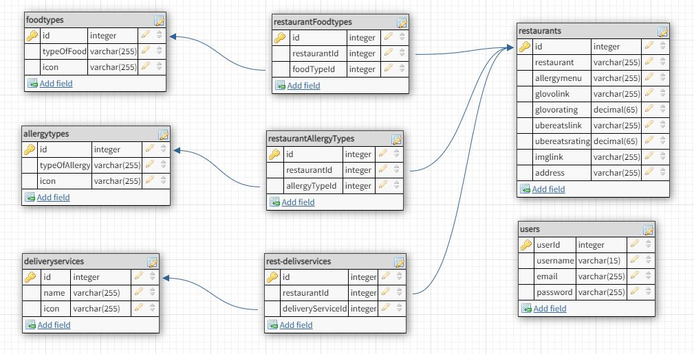

# allergens

An app to find restaurants that has an allergy menu. Once you are in, you can look for restaurants divided by types of food, type of allergy or delivery service.

In the original MVP the relation between restaurants and types of food was one-to-one, and for the feature extension was included the many-to-many relationships not only with types of food but also with types of allergies and delivery services in order to improve the search.

## Used Technologies

The main technology implemented for this feature extension is Sequelize.

- Database: MySQL and Sequelize to improve the new changes.
- Backend: Node/Express
- Frontend: React

## Setup

### Dependencies

- Run `npm install` in project directory. This will install server-related dependencies such as `express`.
- `cd client` and run `npm install`. This will install client dependencies (React).

### Database Prep

- Access the MySQL interface in your terminal
- Create a new database called allergens: `create database allergens`
- Add a `.env` file to the project folder of this repository containing the MySQL authentication information for MySQL user. For example:

```bash
  DB_HOST=localhost
  DB_USER=root
  DB_NAME=allergens
  DB_PASS=YOURPASSWORD
```

- Run `npm run migrate` in the project folder of this repository, in a new terminal window. It already includes the command in `package.json` to migrate using sequelize (`npx sequelize-cli db:migrate`) so you don't need to modify anything. This will create 8 tables in your database (described below in Database Schema).

## Seeds

In order to have restaurants, types of food, delivery services and all the data related, by running `npx sequelize-cli db:seed:all` you will have all the seeds that were planted with that info.

## Folders related to the migration

- `config`, containing config file, which tells CLI how to connect with database

- `models`, containing all models for this project

- `migrations`, contains all migration files

- `seeders`, contains all seed files

### Development

- Run `npm start` in project directory to start the Express server on port 5000
- In another terminal, do `cd client` and run `npm start` to start the client in development mode with hot reloading in port 3000

- ## API endpoints

Main endpoint to filter restaurants by type of food, type of allergy and delivery services (GET):

```javascript
router.get("/", async function (req, res) {
  try {
    const restaurants = await models.Restaurant.findAll({
      include: [
        {
          model: models.FoodType,
          through: {
            where: req.query.foodTypes
              ? {
                  FoodtypeId: req.query.foodTypes.split(","),
                }
              : true,
          },
          required: true,
        },
        {
          model: models.DeliveryService,
          through: {
            where: req.query.deliveryServices
              ? {
                  DeliveryServiceId: req.query.deliveryServices.split(","),
                }
              : true,
          },
          required: true,
        },
        {
          model: models.AllergyType,
          through: {
            where: req.query.allergyTypes
              ? {
                  AllergytypeId: req.query.allergyTypes.split(","),
                }
              : true,
          },
          required: true,
        },
      ],
    });
    res.send(restaurants);
  } catch (error) {
    res.status(500).send(error);
  }
});
```

And POST to create a new restaurant and set all its typologies:

```javascript
router.post("/", async (req, res) => {
  console.log(req.body);
  try {
    const {
      restaurant,
      glovoLink,
      glovoRating,
      uberEatsLink,
      uberEatsRating,
      imgLink,
      address,
      allergyMenu,
      typeOfFood,
      typeOfAllergy,
      name,
    } = req.body;
    const newRestaurant = await models.Restaurant.create({
      restaurant,
      glovoLink,
      glovoRating,
      uberEatsLink,
      uberEatsRating,
      imgLink,
      address,
      allergyMenu,
    });
    if (typeOfFood) await newRestaurant.setFoodTypes(typeOfFood);
    if (typeOfAllergy) await newRestaurant.setAllergyTypes(typeOfAllergy);
    if (name) await newRestaurant.setDeliveryServices(name);
    res.status(201).send(newRestaurant);
  } catch (error) {
    res.status(500).send(error);
  }
});
```

Also:
GET - /restaurants/:id - to get one restaurant by ID
DELETE - /restaurants/:id - to delete a restaurant an all its connections
GET - /allergytypes - to get all the types of allergies
DELETE - /allergytypes/:id - to delete a type of allergy
POST - /allergytypes - to create a new type of allergy
GET - /foodtypes - to get all the types of food
DELETE - /foodtypes/:id - to delete a type of food
POST - /foodtypes - to create a new type of food
GET - /deliveryservices - to get all the delivery services
DELETE - /deliveryservices/:id - to delete a delivery service
POST - /deliveryservices - to create a new delivery service

- ## Database layout

  

# Future Expansion Ideas

- add a log in feature so users can have a profile and save their favourite restaurants. PARTIALLY DONE

- add more search parameters: by delivery service, location, allergen. DONE! -except for location-

- make it so each restaurant can have more than one type of food. DONE!

- add a carousel of images on each restaurant card.

- add a "see more restaurants" button to the all restaurants and search results pages, limiting the amount of cards that load at the beginning.

_This is a student project that was created at [CodeOp](http://codeop.tech), a full stack development bootcamp in Barcelona._
